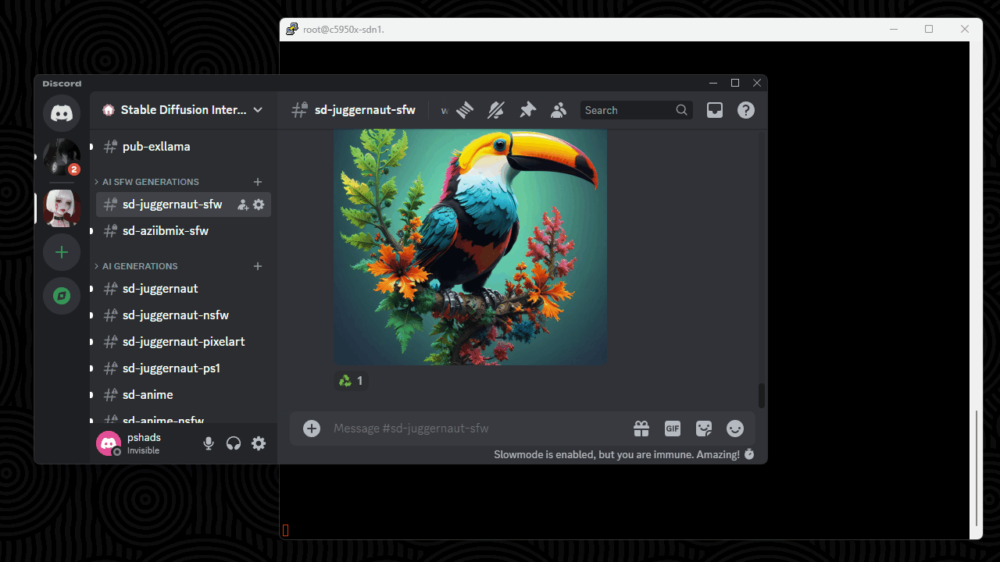
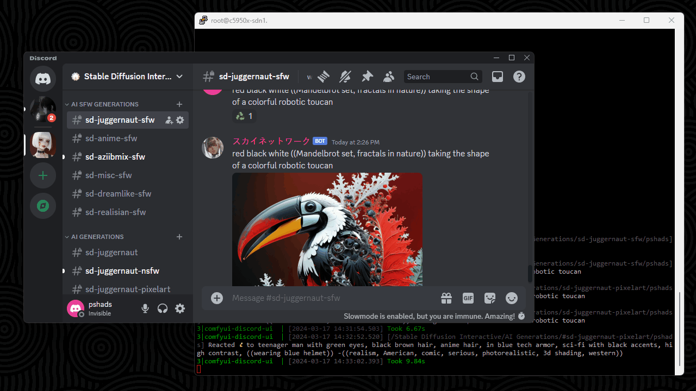
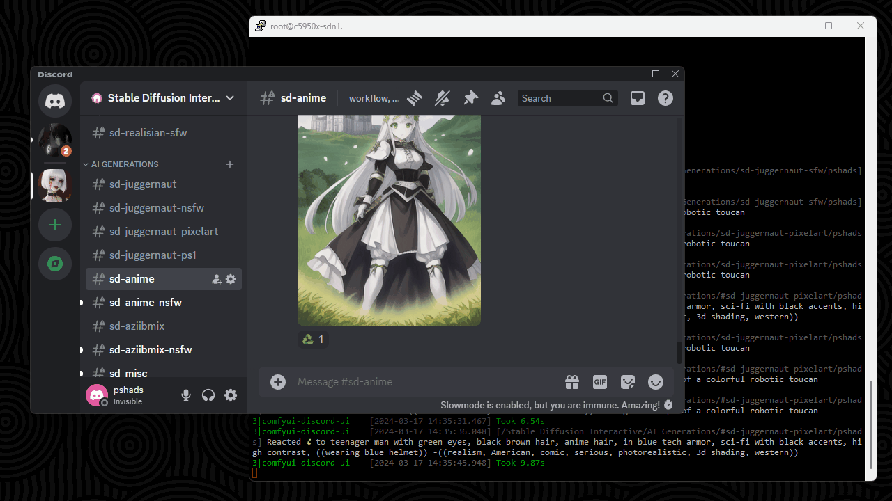

###### Installation

Python 3.11 must be installed

**Note:** When migrating, delete the `__pycache__` and `venv` directories

To create the Python venv:

    python3 -m venv venv
    source ./venv/bin/activate
    pip install -r requirements.txt

To activate and run:

    # Linux
    source ./venv/bin/activate
    python3 bot.py

    # Windows
    call venv\Scripts\activate.bat
    python bot.py

---

###### Mission Statements

* To make ComfyUI and its advanced features accessible through a Discord server and its channel structure

* To keep image generation as free and open source as possible while providing education on and access to Stable Diffusion

---

###### Features

* Turn user input in channel to AI imagery

* Support for load balancing across multiple ComfyUI installations

* Batches of images

* Custom resolutions, aspect ratios, and values for iterations and CFG

* Convenient reaction based actions, such as "redo this"

---

###### Configuration

* `defaults.json` — A set of default options that every request starts out with

* `defaults/channel-topic-token.json` — Options to be merged defined by the tokens specified in the channel's topic

    * **Example:**

        If the user's request is posted in a channel the bot has access to and the channel's topic reads `workflow, token-a, token-b, token-c`, the files `defaults/workflow.json`, `defaults/token-a.json`, `defaults/token-b.json`, and `defaults/token-c.json` will be loaded and merged in that order.

* `categories/category-name.json` — Options to be merged depending on the channel's category name

* `roles/role-name-or-id.json` — Options to be merged depending on the requestor's roles and the corresponding

* `users/user-name-or-id.json` — Options to be merged depending on the requestor's username and/or their user ID

---

###### The Process

This bot can only respond to messages it has access to read. When a message is successfully captured, the following process occurs:

1. A message is sent to a channel the bot has read and write access to with the following details:

    * Channel name: `some-channel-name`

    * Channel category: `Some Category`

    * Channel topic: `workflow-a, some-model, some-rules`

    * Message content: `steps25 cfg8 > detailed photo of a bowl of fruit -yellow, banana x5`

    * Author's username: `pshads`

    * Author's roles: `Test, Role A, Role B`

1. The channel topic is read

1. If the file `workflows/workflow-a.json` exists, proceed

1. Load the contents of `defaults.json` into memory

1. If any of the following files exist, merge them in the order they appear:

    * `defaults/workflow-a.json`

    * `defaults/some-model.json`

    * `defaults/some-rules.json`

    * **Note:**

        None of the aforementioned files are required to exist in the `defaults/` directory, but the first token must exist as a workflow in the `workflows/` directory.

1. Load and merge the contents of `categories/Some Category.json` if it exists

1. Read all user roles

1. If any of the following files exist, merge them in the order they appear:

    * `roles/Test.json`

    * `roles/Role A.json`

    * `roles/Role B.json`

    * **Note:**

        A role's ID can be used in place of its name.

1. Load and merge the contents of `users/pshads.json` if it exists

    * **Note:**

        A user's ID can be used in place of their name.

1. Set the following values from the user's message:

    * `steps` = `25`

    * `cfg` = `8`

    * `positive` = `detailed photo of a bowl of fruit`

    * `negative` = `yellow, banana`

    * `batch_size` = `5`

    * **Note:**

        In any of the previous `.json` files loaded and merged, if such keys exist like `max_steps` and `max_batch_size`, the user supplied values will be limited to the suggested maximum value. For example, if the option `max_batch_size` is set to `1` in any of the configuration before the user's message is processed, the `x5` is effectively ignored and a `batch_size` of `1` will be passed to the `workflow-a.json`.

---

###### Message Syntax

The following message serves as an ideal example for the bot to read from a channel that employs the AnythingV3 model:

    384p steps15 cfg6 3x4 > ((photorealistic)) 1girl close portrait, white dress, black hair, red eyes, standing alone on a cliffside, grass and stone walls, ocean in the background, 4K 8K ultra HD, best quality, detailed masterpiece, DSLR quality, f1.8, dof, depth of field, in focus, sparks and dust particles -((3d shading)), disfigured, malformed, bad anatomy, extra digits, blurry, hazy, grit x4

There are three major components (and one minor) to the example message above:

* **Options:**

        384p steps15 cfg6 3x4

    Options are *completely optional* but allow a Discord user to change some attributes of the generation independent of the channel structure. For example, the option `384p` tells the workflow we would like to see 384x384 output. Specifying `3x4` tells the bot to make the output have the aspect ratio of 3x4 with its largest side being `384p`.

* **Positive Prompt:**

        ((photorealistic)) 1girl close portrait, white dress, black hair, red eyes, standing alone on a cliffside, grass and stone walls, ocean in the background, 4K 8K ultra HD, best quality, detailed masterpiece, DSLR quality, f1.8, dof, depth of field, in focus, sparks and dust particles

    The positive prompt tells Stable Diffusion what subjects to try generating based on the tokens provided and the training of the model being used. The token `1girl` is specific to the AnythingV3 model and will narrow all possible results down to images that include a subject with a female appearance.

* **Negative Prompt:**

        ((3d shading)), disfigured, malformed, bad anatomy, extra digits, blurry, hazy, grit

    Negative prompts work to subtract ideas from the posibility of being generated. As an easy example, if you wanted to generate a bowl of fruit but it kept including bananas, you can "subtract" *yellow* and *banana* from the generated output by including those tokens in the negative prompt if bananas were undesirable.

* **Batch Size:**

        x4

    Appending ` xN` to the end of a prompt set will tell the parser to set `batch_size` to `N`. At the moment, Discord only allows for up to 8 attachments per message, so if the requested batch size is greater than any multiple of 8, additional messages will be sent until all images are returned.

---

###### Glossary

* **CFG** — Classifier-free guidence scale; a parameter on how much a prompt is followed or deviated from

* **Channel Topic Token** — A token or word from list of tokens defined in a channel's topic, separated by commas

* **ComfyUI** — A program that allows users to design and execute Stable Diffusion workflows to generate images and animated `.gif` files

* **Iteration** — A single step in the image diffusion process

* **Workflow** — A `.json` file produced by ComfyUI that can be modified and sent to its API to produce output
